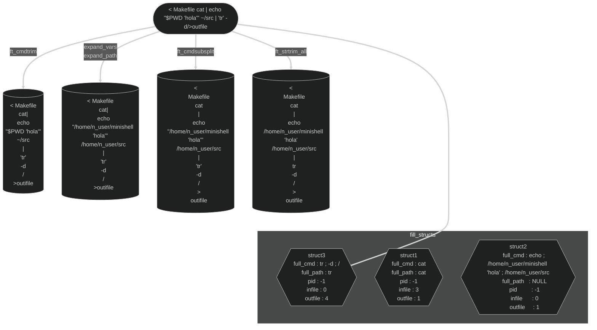
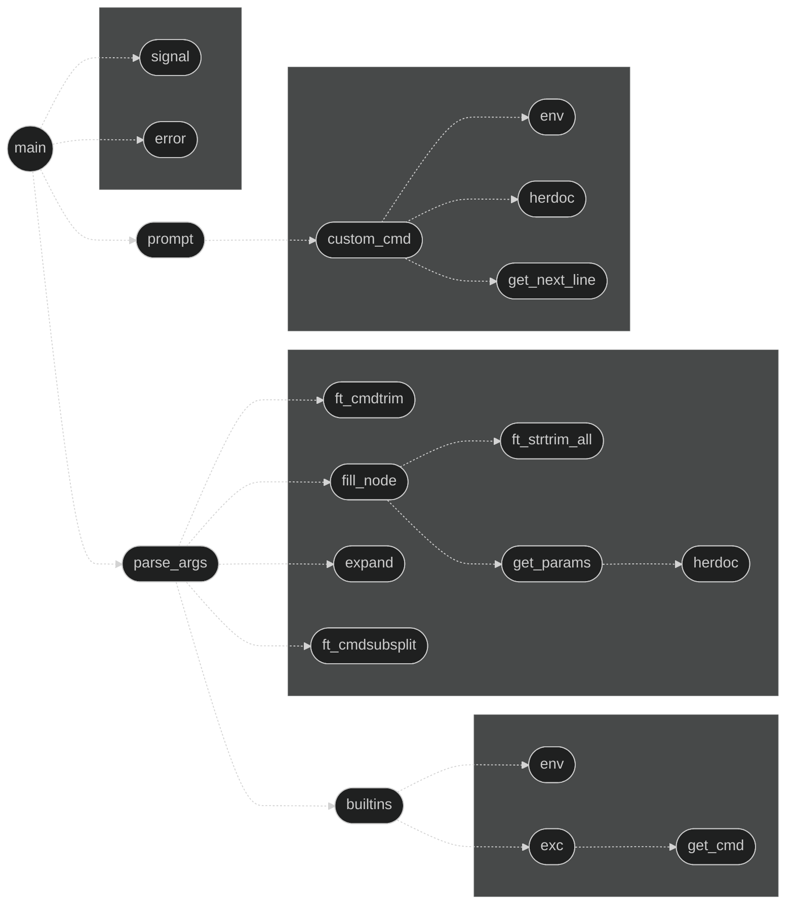

```Bash
███╗   ███╗██╗███╗   ██╗██╗███████╗██╗  ██╗███████╗██╗     ██╗     
████╗ ████║██║████╗  ██║██║██╔════╝██║  ██║██╔════╝██║     ██║     
██╔████╔██║██║██╔██╗ ██║██║███████╗███████║█████╗  ██║     ██║     
██║╚██╔╝██║██║██║╚██╗██║██║╚════██║██╔══██║██╔══╝  ██║     ██║     
██║ ╚═╝ ██║██║██║ ╚████║██║███████║██║  ██║███████╗███████╗███████╗
╚═╝     ╚═╝╚═╝╚═╝  ╚═══╝╚═╝╚══════╝╚═╝  ╚═╝╚══════╝╚══════╝╚══════╝
```
*The objective of this project is for you to create a simple shell.*

 Skills | Grade |
:------:|:-----:|
[**Unix**] [**Rigor**] [**Imperative programming**] | **Subscribed :atom:**
<!-- **:white_check_mark: 100%** -->

<!-- * ### [Introduction]() -->
* ### [Mandatory part](#mandatory-part-1)
* ### [Mind Map](#mind-map-1)
* ### [Overview](#overview-1)
<!-- * ### [Usage]() -->
* ### [Study resources](#study-resources-1)
<!-- * ### [Tools]() -->
<!-- * ### [Workflow]() -->

## Mandatory part
*Subject Comentado**

Program name | minishell
------------ | ---------
Turn in files| Makefile, *.h, *.c
Makefile     | NAME, all, clean, fclean, re
Arguments    | None
External functs.| readline, rl_clear_history, rl_on_new_line, rl_replace_line, rl_redisplay, add_history, printf, malloc, free, write, access, open, read, close, fork, wait, waitpid, wait3, wait4, signal, sigaction, sigemptyset, sigaddset, kill, exit, getcwd, chdir, stat, lstat, fstat, unlink, execve, dup, dup2, pipe, opendir, readdir, closedir, strerror, perror, isatty, ttyname, ttyslot, ioctl, getenv, tcsetattr, tcgetattr, tgetent, tgetflag, tgetnum, tgetstr, tgoto, tputs
Libft authorized | Yes
Description  | Write a shell

### Funcoes externas:
<details>
  <summary>Click to expand </summary>
  
Funcoes externas | Header | Brief
------- | ------ | -----
**readline** | `<readline/readline.h>` | Fornece facilidades para leitura de linhas de texto de entrada.
**rl_clear_history** | `<readline/readline.h>` | Limpa o histórico de comandos no readline.
**rl_on_new_line** | `<readline/readline.h>` |  Informa ao readline que a próxima leitura deve começar em uma nova linha.
**rl_replace_line** | `<readline/readline.h>` | Substitui a linha de entrada atual no readline.
**rl_redisplay** | `<readline/readline.h>` | Redesenha a linha de entrada no readline.
**add_history** | `<readline/history.h>` | Adiciona uma linha ao histórico do readline.
**printf** | `<stdio.h>` | Imprime texto formatado no console.
**malloc** | `<stdlib.h>` | Aloca memória dinamicamente.
**free** | `<stdlib.h>` | Libera a memória alocada dinamicamente.
**write** | `<unistd.h>` | Escreve dados em um descritor de arquivo.
**access** | `<unistd.h>` | Verifica a existência e permissões de arquivos.
**open** | `<fcntl.h>` | Abre ou cria um arquivo.
**read** | `<unistd.h>` | Lê dados de um descritor de arquivo.
**close** | `<unistd.h>` | Fecha um descritor de arquivo.
**fork** | `<unistd.h>` | Cria um novo processo (fork).
**wait** | `<sys/wait.h>` | Aguardam o término de um processo filho.
**waitpid** | `<sys/wait.h>` | Aguardam o término de um processo filho.
**wait3** | `<sys/wait.h>` | Aguardam o término de um processo filho.
**wait4** | `<sys/wait.h>` | Aguardam o término de um processo filho.
**signal** | `<signal.h>` | Manipulam sinais.
**sigaction** | `<signal.h>` | Manipulam sinais.
**sigemptyset** | `<signal.h>` | Manipulam sinais.
**sigaddset** | `<signal.h>` | Manipulam sinais.
**kill** | `<signal.h>` | Envia um sinal para um processo.
**exit** | `<stdlib.h>` | Encerra o processo 
**getcwd** | `<unistd.h>` | Obtém o diretório de trabalho atual. 
**chdir** | `<unistd.h>` | Muda o diretório de trabalho. 
**stat** | `<sys/stat.h>` | Obtêm informações sobre arquivos.
**lstat** | `<sys/stat.h>` | Obtêm informações sobre arquivos.
**fstat** | `<sys/stat.h>` | Obtêm informações sobre arquivos.
**unlink** | `<unistd.h>` | Remove um arquivo.
**execve** | `<unistd.h>` | Executa um programa. 
**dup** | `<unistd.h>` | Duplicam descritores de arquivo.
**dup2** | `<unistd.h>` | Duplicam descritores de arquivo.
**pipe** | `<unistd.h>` | Cria um pipe.
**opendir** | `<dirent.h>` | Manipulam diretórios.
**readdir** | `<dirent.h>` | Manipulam diretórios.
**closedir** | `<dirent.h>` | Manipulam diretórios.
**strerror** | `<string.h>` | Convertem códigos de erro em mensagens de erro.
**perror** | `<string.h>` | Convertem códigos de erro em mensagens de erro.
**isatty** | `<unistd.h>` | Manipulam informações do terminal. 
**ttyname** | `<unistd.h>` | Manipulam informações do terminal. 
**ttyslot** | `<unistd.h>` | Manipulam informações do terminal. 
**ioctl** | `<ioctl.h>` | Controla dispositivos.
**getenv** | `<stdlib.h>` | Obtém o valor de uma variável de ambiente.
**tcsetattr** | `<termios.h>` | Configuram e obtêm atributos do terminal.
**tcgetattr** | `<termios.h>` | Configuram e obtêm atributos do terminal.
**tgetent** | `<term.h>` | Gerenciam terminais com capacidades ANSI.
**tgetflag** | `<term.h>` | Gerenciam terminais com capacidades ANSI.
**tgetnum** | `<term.h>` | Gerenciam terminais com capacidades ANSI.
**tgetstr** | `<term.h>` | Gerenciam terminais com capacidades ANSI.
**tgoto** | `<term.h>` | Gerenciam terminais com capacidades ANSI.
**tputs** | `<term.h>` | Gerenciam terminais com capacidades ANSI.
</details>

### Seu shell deve:
#### Modo interativo
* Exibir um **prompt** ao aguardar um novo comando.
  * Na forma interativa o **Shell** aceita entradas digitadas do teclado.
---
* Ter um **histórico** de trabalho.
* Pesquise e inicie o executável correto (com base na variável **PATH** ou usando um
caminho relativo ou absoluto).
* Evite usar mais de **uma variável global** para indicar um sinal recebido. Considere as implicações: esta abordagem garante que o seu manipulador de sinal não acessará suas principais estruturas de dados.

***Tome cuidado. Esta variável global não pode fornecer nenhuma outra informação ou acesso a dados além do número de um sinal recebido. Portanto, é proibido o uso de estruturas do tipo "norm" no escopo global.***

* Não interpretar aspas não fechadas ou caracteres especiais que não sejam exigidos pelo assunto, como **\\** (barra invertida) ou **;** (ponto e vírgula).
* Lidar **'** (aspas simples) que deve evitar que o shell interprete os metacaracteres na sequência citada.
* Lidar **"** (aspas duplas) que deve evitar que o shell interprete os metacaracteres na sequência citada, exceto **$** (cifrão).

#### **Implementar redirecionamentos:**
* **<** deve redirecionar a entrada. 
  * O redirecionamento de entrada faz com que o arquivo cujo nome resulta da expansão do `word` seja aberto para leitura no descritor de arquivo `n`, ou na entrada padrão (descritor de arquivo 0) caso não seja especificado. Ex. `[n]< word`
* **\>** deve redirecionar a saída. refere-se à saída padrão (descritor de arquivo 1)
  * O operador de redirecionamento de saída > no Bash é usado para redirecionar a saída de um comando para um arquivo. Ele permite que você armazene o resultado da execução de um comando em um arquivo, sobrescrevendo o conteúdo existente ou criando um novo arquivo, dependendo da situação.\
`echo 'Olá, Mundo!' > saudacao.txt`\
*echo 'Olá, Mundo!' é redirecionada para o arquivo saudacao.txt*
* **<<** deve receber um delimitador e, em seguida, leia a entrada até que uma linha contendo o delimitador seja vista. No entanto, não é necessário atualizar o histórico!
  * Os here documents (<<) no shell Bash são usados para fornecer entrada para um comando a partir de um bloco de texto diretamente no script ou na linha de comando. Eles são especialmente úteis quando você deseja passar várias linhas de entrada para um comando sem ter que criar um arquivo temporário.\
A sintaxe básica é a seguinte:
```bash
comando << DELIMITADOR
Texto da entrada
Mais linhas de entrada
DELIMITADOR
```
* **\>>** deve redirecionar a saída no modo de acréscimo.definir valor da variável 
  * O operador de redirecionamento de saída >> no Bash é utilizado para redirecionar a saída de um comando para um arquivo, mas, ao contrário de >, ele não substitui o conteúdo existente do arquivo. Em vez disso, >> anexa a saída ao final do arquivo, preservando o conteúdo anterior.
* Implementar **pipes** (**|** caractere). A saída de cada comando no pipeline é conectada à entrada do próximo comando por meio de um pipe.
* Lidar com **variáveis de ambiente** (**$** seguidas por uma sequência de caracteres) que devem se expandir para seus valores.

#### Lidar com **$?** (esta é uma das variáveis de Controle de Fluxo)
Deve se expandir para o status de saída do pipeline em primeiro plano executado mais recentemente.
* A variável especial **$?** no Bash contém o código de retorno (exit status) do último comando executado. O código de retorno é um numero inteiro que indica se o comando foi executado com sucesso ou se ocorreu algum erro durante a execução.
  * Se **$?** for igual a 0, isso significa que o último comando foi executado com sucesso.
  * Se **$?** for diferente de 0, indica que ocorreu algum erro durante a execução do último comando.

* Lidar com **ctrl-C**, **ctrl-D** e **ctrl-\\** que devem se comportar como no **bash**.
  * No modo interativo:
    * **ctrl-C** exibe um novo prompt em uma nova linha.
    * **ctrl-D** sai do shell.
    * **ctrl-\\** não faz nada.

#### Comandos integrados/simples (builtins)
##### Seu shell deve implementar os seguintes builtins:
1. `echo` com opção `-n`: *Exibe mensagens na tela.*
    - O comando `echo` no Bash é usado para imprimir argumantos ou variáveis de ambiente na tela, separados por um espaço, terminando com uma nova linha.
    - A opção `-n`  é usada para suprimir a adição de uma nova linha ao final da saída.
    ```Bash
    bash-3.2$ echo -n "Olá " && echo "Mundo"
    Olá Mundo
    ```
2. `cd` com apenas um caminho relativo ou absoluto: *Muda o diretório atual.*
    1. Caminho Absoluto: Um caminho absoluto é a localização exata do diretório ou arquivo no sistema de arquivos, começando pela raiz (root). Por exemplo, `/home/user/Documents` é um caminho absoluto.
    2. Caminho Relativo: Um caminho relativo é a localização de um diretório ou arquivo em relação ao diretório atual. Por exemplo, se você estiver no diretório `/home/user`, você pode mudar para o diretório Documents com `cd Documents`, que é um caminho relativo.
    - Mudar para o diretório home do usuário: `cd`
    - Mudar para um diretório relativo: `cd Documents`
    - Mudar para um diretório absoluto: `cd /home/user/Documents`
3. `pwd` sem opções: *Mostra o diretório atual.*
    - Imprime o nome do caminho absoluto do diretório de trabalho atual. 
4. `export` sem opções: *Define variáveis de ambiente.*
5. `unset` sem opções: *Remove variáveis de ambiente.*
6. `env` sem opções ou argumentos: *Mostra as variáveis de ambiente.*
7. `exit` sem opções: *Sai do shell.*
    - O comando `exit` no Bash é usado para terminar uma sessão de terminal. Ele fecha a shell atual. Se você estiver em uma sessão de terminal interativa, o terminal será fechado. Se o terminal estiver sendo executado como um processo filho (subshell), o processo filho será encerrado e o terminal pai permanecerá aberto.
---
  *A função **readline()** pode causar vazamentos de memória. Você não precisa consertá-los. Mas isso **não significa que seu próprio código, sim, o código que você escreveu, pode ter memmory leaks**.*

***Você deve se limitar à descrição do assunto. Tudo o que não é pedido não é obrigatório. Se você tiver alguma dúvida sobre algum requisito, tome o [bash](https://www.gnu.org/savannah-checkouts/gnu/bash/manual/) como referência.***

[↑ Index ↑](#top)

## Mind Map

### Parser


### Minishell


[↑ Index ↑](#top)

## Overview
### [Resumo manual do Bash](https://www.gnu.org/software/bash/manual/bash.html)
>*Bourne-Again Shell*

### Forma interativa e não interativa
O **Shell** pode ser usado de forma interativa ou não interativa. No modo\
interativo, eles aceitam entradas digitadas do teclado. Ao executar de forma\
não interativa, os shells executam comandos lidos de um arquivo.

### Execução de comandos **síncrona** e **assíncrona**
Um shell permite a execução de comandos GNU, tanto de forma síncrona quanto\
assíncrona. O shell aguarda a conclusão dos comandos síncronos antes de aceitar\
mais entradas; os comandos assíncronos continuam a ser executados em paralelo\
com o shell enquanto ele lê e executa comandos adicionais. As construções de\
redirecionamento permitem um controle refinado da entrada e saída desses comandos.\
Além disso, o shell permite o controle sobre o conteúdo dos ambientes dos comandos.

### Comandos integrados (builtins)
Os shells também fornecem um pequeno conjunto de comandos integrados (builtins)\
que implementam funcionalidades impossíveis ou inconvenientes de serem obtidas\
por meio de utilitários separados. Por exemplo, **cd**, **break**, **continue**\
e **exec** não podem ser implementados fora do shell porque manipulam diretamente\
o próprio shell. Os componentes internos **history**, **getopts**, **kill** ou\
**pwd**, entre outros, podem ser implementados em utilitários separados, mas são\
mais convenientes para usar como comandos internos. Todos os componentes internos\
do shell são descritos nas seções subsequentes.

Alguns comandos builtins no Bash incluem:

1. `echo`: Exibe mensagens na tela.
2. `cd`: Muda o diretório atual.
3. `pwd`: Mostra o diretório atual.
4. `export`: Define variáveis de ambiente.
5. `unset`: Remove variáveis de ambiente.
6. `env`: Mostra as variáveis de ambiente.
7. `exit`: Sai do shell.
8. `alias`: Cria um alias para um comando.
9. `source` (ou `.`): Executa comandos a partir de um arquivo.
10. `history`: Exibe histórico de comandos.
11. `set`: Configura opções do shell.

Esses são alguns dos comandos builtins mais comuns. Há outros também, dependendo\
da versão do Bash e das configurações específicas do sistema.

### Comandos builtins utilizados no projeto
1. `echo` with option -n
2. `cd` with only a relative or absolute path
3. `pwd` with no options
4. `export` with no options
5. `unset` with no options
6. `env` with no options or arguments
7. `exit` with no options

*A opção `-n` no comando `echo` no Bash é usada para suprimir a adição de uma nova linha ao final da saída. Quando você usa `echo -n`, a próxima linha de saída ou texto será impressa na mesma linha, sem quebra de linha automática no final. Isso pode ser útil em scripts ou em situações em que você deseja controlar explicitamente a formatação da saída.*
```Bash
bash-3.2$ echo -n "Olá " && echo "Mundo"
Olá Mundo
```

### control operator
Os operadores de controle (control operators) no Bash são usados para controlar o fluxo de execução dos comandos. Aqui estão alguns operadores de controle comuns:

1. `;` (ponto e vírgula): Permite a execução sequencial de comandos, um após o outro.

   ```bash
   comando1 ; comando2
   ```

2. `&&` (AND lógico): Executa o segundo comando apenas se o primeiro for bem-sucedido (retorna status de saída 0).

   ```bash
   comando1 && comando2
   ```

3. `||` (OR lógico): Executa o segundo comando apenas se o primeiro falhar (retorna status de saída diferente de 0).

   ```bash
   comando1 || comando2
   ```

4. `&` (ampersand): Permite que um comando seja executado em segundo plano.

   ```bash
   comando &
   ```

5. `|` (pipe): Redireciona a saída de um comando como entrada para outro comando.

   ```bash
   comando1 | comando2
   ```

6. `;;` (ponto e vírgula duplo): Usado em instruções `case` dentro de um bloco `select` ou `case` para indicar o final de um padrão e o final do bloco `case`.

   ```bash
   case $variavel in
       padrão1) comandos1 ;;
       padrão2) comandos2 ;;
       *) padrão_geral ;;
   esac
   ```

7. `;&` (ampersand duplo): Usado em instruções `case` para indicar que, após a execução dos comandos sob um padrão, a execução deve continuar no próximo padrão.

   ```bash
   case $variavel in
       padrão1) comandos1 ;&
       padrão2) comandos2 ;;
   esac
   ```

8. `;;&` (ampersand duplo e ponto e vírgula duplo): Similar ao `;&`, mas inicia a execução no próximo padrão sem verificar as condições.

   ```bash
   case $variavel in
       padrão1) comandos1 ;;
       padrão2) comandos2 ;;&
       padrão3) comandos3 ;;
   esac
   ```

9. `|&` (pipe e ampersand): Redireciona tanto a saída padrão quanto a saída de erro do comando anterior para o próximo comando.

   ```bash
   comando1 |& comando2
   ```
Esses são alguns dos operadores de controle mais comuns no Bash. Eles são utilizados para compor e controlar o fluxo de execução de comandos no shell.

### Token
Um token é uma sequência de caracteres que o shell trata como uma unidade. Existem cinco tipos de tokens: palavras, operadores, caracteres de controle de fluxo, caracteres de expansão e caracteres de separação.

### Word
Uma palavra é uma sequência de caracteres que o shell trata como um nome de comando, nome de variável, nome de arquivo ou algum outro tipo de unidade. Existem três tipos de palavras: palavras reservadas, palavras literais e palavras de operador. As palavras não podem incluir metacaracteres sem aspas.

### Operação do Shell
1. Lê uma linha de entrada. (No caso de um arquivo de script, o shell lê uma linha do arquivo.)
2. Divide a entrada em palavras e operadores, obedecendo às regras de expansão e aos caracteres de escape.
3. Analisa os tokens em comandos simples e compostos.
4. Executa as diversas expansões de shell, dividindo os tokens expandidos em listas de nomes de arquivos e comandos e argumentos.
5. Executa quaisquer redirecionamentos necessários e remove os operadores de redirecionamento e seus operandos da lista de argumentos.
6. Executa um comando.
7. Opcionalmente, aguarda a conclusão do comando e coleta seu status de saída.

### Citação
A citação é usada para remover o significado especial de certos caracteres ou palavras-chave para o shell. Existem três tipos de citação: 'aspas simples', "aspas duplas" e barra invertida \\.

### Comandos Shell
Um comando shell simples como `echo a b c` consiste no próprio comando seguido de argumentos, separados por espaços.\
Comandos shell mais complexos são compostos de comandos simples organizados juntos de diversas maneiras: em um pipeline no qual a saída de um comando se torna a entrada de um segundo, em um loop ou construção condicional ou em algum outro agrupamento.

### Redirecionamento
O redirecionamento é uma forma de alterar a entrada e/ou saída padrão de um comando. O redirecionamento é aplicado a um comando após a expansão de variáveis, mas antes da execução do comando. O redirecionamento é indicado por um operador de redirecionamento seguido por um nome de arquivo.\
Os redirecionamentos são processados ​​na ordem em que aparecem, da esquerda para a direita.
#### Redirecionamento de entrada: `comando [n]< arquivo`
O redirecionamento de entrada faz com que o arquivo seja aberto para leitura no descritor de arquivo `n`, ou na entrada padrão (descritor de arquivo 0) caso nnão seja especificado.
#### Redirecionando Saída: `comando > arquivo`
O operador de redirecionamento de saída > no Bash é usado para redirecionar a saída de um comando para um arquivo. Ele permite que você armazene o resultado da execução de um comando em um arquivo, sobrescrevendo o conteúdo existente ou criando um novo arquivo, dependendo da situação.
`echo 'Olá, Mundo!' > saudacao.txt`
*echo 'Olá, Mundo!' é redirecionada para o arquivo saudacao.txt.*

No caso da string com aspas duplas ao incluir o ponto de exclamação ! no final da string "Olá, Mundo!", o Bash interpreta isso como uma tentativa de buscar e executar um comando no histórico que começa com a string "Olá, Mundo!". Como o Bash não encontra tal comando no histórico, ele exibe o prompt dquote>, indicando que está esperando que você forneça o restante do comando.

Para evitar esse comportamento, você pode escapar o caractere de ponto de exclamação usando uma barra invertida \:
`echo "Olá, Mundo\!" > saudacao.txt`

#### Redirecionamento de saída `>>` 
No Bash é utilizado para redirecionar a saída de um comando para um arquivo, mas, ao contrário de `>`, ele não substitui o conteúdo existente do arquivo. Em vez disso, `>>` anexa a saída ao final do arquivo, preservando o conteúdo anterior.

A sintaxe básica é a seguinte:

```bash
comando >> arquivo
```

Isso significa que a saída do comando será adicionada ao final do arquivo especificado. Se o arquivo não existir, ele será criado.

Exemplo:

```bash
echo "Primeira linha" > arquivo.txt
echo "Segunda linha" >> arquivo.txt
```

Após esses comandos, o arquivo `arquivo.txt` terá o seguinte conteúdo:

```
Primeira linha
Segunda linha
```

O primeiro `echo` usa `>` para criar e escrever a "Primeira linha" no arquivo, enquanto o segundo `echo` usa `>>` para anexar a "Segunda linha" ao final do arquivo existente.

Essa é uma maneira útil de acumular dados em um arquivo sem perder o conteúdo anterior.

#### Here Documents `<<`
Aqui estão alguns exemplos adicionais de here documents (`<<`) com diferentes comandos no Bash:

1. `cat` com Here Document
```bash
cat << EOL
Linha 1
Linha 2
Linha 3
EOL
```
Este exemplo utiliza um here document para fornecer entrada para o comando `cat`.

2. `grep` com Here Document
```bash
grep "padrão" << EOL
Linha com padrão
Outra linha sem padrão
EOL
```
Neste caso, um here document é usado para fornecer linhas para o comando `grep`, que busca por um padrão específico.

3. `sed` com Here Document
```bash
sed 's/antes/depois/' << EOL
Texto com "antes".
EOL
```
Este exemplo utiliza um here document para fornecer texto ao comando `sed`, que substitui "antes" por "depois".

5. `ssh` com Here Document
```bash
ssh usuario@host << EOL
comando_remoto_1
comando_remoto_2
EOL
```
Neste exemplo, um here document é usado para enviar comandos remotamente via SSH.

5. `ftp` com Here Document
```bash
ftp -n << EOL
open exemplo.com
user usuário senha
put arquivo.txt
bye
EOL
```
Aqui, um here document é utilizado para enviar comandos FTP.

Os here documents são versáteis e podem ser usados com vários comandos diferentes, permitindo a entrada de dados de forma eficiente em scripts ou na linha de comando.

### Expansão de Comando Simples
A expansão de comando simples é a forma mais básica de expansão de shell. Ela ocorre quando um comando é precedido por um caractere de crase ` ou entre parênteses $(). O shell executa o comando dentro da expansão de comando simples e substitui a expansão pelo resultado da execução. Nenhuma etapa de tokenização é realizada, portanto, o resultado da expansão de comando simples é uma única palavra.\
Exemplo:
```bash
resultado=`ls`
echo "Os arquivos no diretório são: $resultado"
```

###  Busca e Execução de Comandos

Depois que um comando for dividido em palavras, se resultar em um comando simples e uma lista opcional de argumentos, as seguintes ações serão executadas.

1. Se o nome do comando não contiver barras, o shell tentará localizá-lo. Se existir uma função shell com esse nome, essa função será invocada conforme descrito em [Funções Shell](https://www.gnu.org/software/bash/manual/bash.html#Shell-Functions).
Se o nome não corresponder a uma função, o shell procurará por ele na lista de componentes internos do shell. Se uma correspondência for encontrada, esse recurso interno será invocado.
2. Se o nome não for uma função shell nem embutido e não contiver barras, o Bash procurará em cada elemento `$PATH` um diretório contendo um arquivo executável com esse nome. Bash usa uma tabela hash para lembrar os nomes completos dos arquivos executáveis ​​para evitar `PATH` pesquisas múltiplas (veja a descrição hashem Bourne Shell Builtins ). Uma pesquisa completa dos diretórios `$PATH` será executada somente se o comando não for encontrado na tabela hash. Se a pesquisa não for bem-sucedida, o shell procurará uma função de shell definida chamada `command_not_found_handle`. Se essa função existir, ela será invocada em um ambiente de execução separado com o comando original e os argumentos do comando original como seus argumentos, e o status de saída da função se tornará o status de saída desse subshell. Se essa função não estiver definida, o shell imprimirá uma mensagem de erro e retornará um status de saída 127.
4. Se a pesquisa for bem-sucedida ou se o nome do comando contiver uma ou mais barras, o shell executará o programa nomeado em um ambiente de execução separado. O argumento 0 é definido com o nome fornecido e os argumentos restantes do comando são definidos com os argumentos fornecidos, se houver.
5. Se esta execução falhar porque o arquivo não está em formato executável e o arquivo não é um diretório, ele é assumido como um script de shell e o shell o executa conforme descrito em [Shell Scripts](https://www.gnu.org/software/bash/manual/bash.html#Shell-Scripts).
6. Se o comando não foi iniciado de forma assíncrona, o shell aguarda a conclusão do comando e coleta seu status de saída.

### Meio Ambiente (Environment / env)
Quando um programa é invocado, ele recebe uma matriz de strings chamada ambiente . Esta é uma lista de pares nome-valor, no formato name=value.

Bash oferece várias maneiras de manipular o ambiente. Na invocação, o shell verifica seu próprio ambiente e cria um parâmetro para cada nome encontrado, marcando-o automaticamente para exportprocessos filhos. Os comandos executados herdam o ambiente. O `export` e o `declare -x` comandos permitem que parâmetros e funções sejam adicionados e excluídos do ambiente. Se o valor de um parâmetro do ambiente for modificado, o novo valor passa a fazer parte do ambiente, substituindo o antigo. O ambiente herdado por qualquer comando executado consiste no ambiente inicial do shell, cujos valores podem ser modificados no shell, menos quaisquer pares removidos pelos e `unset` e o `export -n` comandos, além de quaisquer adições por meio dos comandos `export` e `declarar -x`.

O ambiente para qualquer comando ou função simples pode ser aumentado temporariamente prefixando-o com atribuições de parâmetros, conforme descrito em Parâmetros do Shell. Estas instruções de atribuição afetam apenas o ambiente visto por esse comando.

Se o `-k` é definida (consulte The Set Builtin ), então todas as atribuições de parâmetros são colocadas no ambiente para um comando, não apenas aquelas que precedem o nome do comando.

Quando o Bash invoca um comando externo, a variável `$_` é definido como o caminho completo do comando e passado para esse comando em seu ambiente.

###  [Status de Saída](https://www-gnu-org.translate.goog/software/bash/manual/bash.html?_x_tr_sl=en&_x_tr_tl=pt&_x_tr_hl=pt-BR&_x_tr_pto=wapp#Exit-Status)

### [Signals](https://www-gnu-org.translate.goog/software/bash/manual/bash.html?_x_tr_sl=en&_x_tr_tl=pt&_x_tr_hl=pt-BR&_x_tr_pto=wapp#Signals)

### Comandos builtins do Bash

#### Comando `cd` (change directory)
É usado para mudar o diretório atual no terminal. Quando usado sem nenhuma opção de flag ou argumento, ele muda para o diretório home do usuário atual.

Existem dois tipos de caminhos que você pode usar com `cd`: relativo e absoluto.

1. Caminho Absoluto: Um caminho absoluto é a localização exata do diretório ou arquivo no sistema de arquivos, começando pela raiz (root). Por exemplo, `/home/user/Documents` é um caminho absoluto.

2. Caminho Relativo: Um caminho relativo é a localização de um diretório ou arquivo em relação ao diretório atual. Por exemplo, se você estiver no diretório `/home/user`, você pode mudar para o diretório Documents com `cd Documents`, que é um caminho relativo.

Aqui estão alguns exemplos de como usar `cd`:

- Mudar para o diretório home do usuário: `cd`
- Mudar para um diretório relativo: `cd Documents`
- Mudar para um diretório absoluto: `cd /home/user/Documents`
- Mudar para o diretório pai: `cd ..`
- Mudar para o diretório anterior: `cd -`

#### Comando `exit`
O comando `exit` no Bash é usado para terminar uma sessão de terminal. Ele fecha a shell atual. Se você estiver em uma sessão de terminal interativa, o terminal será fechado. Se você estiver em um script de shell, a execução do script será encerrada.

Você também pode fornecer um código de status opcional com `exit` para indicar se o script terminou com sucesso ou se houve algum erro. Por exemplo, `exit 0` indica um término bem-sucedido, enquanto `exit 1` geralmente indica que ocorreu algum erro.

#### Comando `export`
A função `export` no Bash é usada para definir variáveis de ambiente. As variáveis de ambiente são um tipo especial de variável que está disponível para processos filhos de um processo. 

Quando você usa `export` sem flags, você está definindo uma variável de ambiente que será passada para todos os processos filhos do shell atual. 

Por exemplo, se você quiser definir uma variável de ambiente chamada `TEST` e dar a ela o valor `Hello World`, você usaria o seguinte comando:

```bash    F===G===H

export TEST="Hello World"
```

Depois de definir uma variável de ambiente, você pode acessá-la em qualquer lugar do seu script usando `$TEST`. 

Se você quiser ver todas as variáveis de ambiente atualmente definidas, você pode usar o comando `env` sem opções ou argumentos.

### Special Builtins
Por razões históricas, o padrão POSIX classificou vários comandos internos como especiais . Quando o Bash está sendo executado no modo POSIX , os comandos internos especiais diferem de outros comandos internos em três aspectos:

1. Recursos internos especiais são encontrados antes das funções do shell durante a pesquisa de comandos.
2. Se um built-in especial retornar um status de erro, um shell não interativo será encerrado.
3. As instruções de atribuição que precedem o comando permanecem em vigor no ambiente shell após a conclusão do comando.

Quando o Bash não está sendo executado no modo POSIX , esses componentes internos não se comportam de maneira diferente do restante dos comandos internos do Bash. O modo Bash POSIX é descrito em Modo Bash POSIX .

Estes são os recursos especiais do POSIX :
`break : . continue eval exec exit export readonly return set shift trap unset`

### Interação Readline
Muitas vezes, durante uma sessão interativa, você digita uma longa linha de texto, apenas para perceber que a primeira palavra da linha está escrita incorretamente. A biblioteca Readline oferece um conjunto de comandos para manipular o texto conforme você o digita, permitindo apenas corrigir o erro de digitação e não forçando você a redigitar a maior parte da linha. Utilizando esses comandos de edição, você move o cursor até o local que precisa de correção e apaga ou insere o texto das correções. Então, quando estiver satisfeito com a linha, basta pressionar RET . Você não precisa estar no final da linha para pressionar RET ; a linha inteira é aceita independentemente da localização do cursor dentro da linha.

[↑ Index ↑](#top)

## Study resources
### Links
- [Bash Reference Manual](https://www.gnu.org/software/bash/manual/bash.html)
- [Book -> Writing Your Own Shell](https://www.cs.purdue.edu/homes/grr/SystemsProgrammingBook/Book/Chapter5-WritingYourOwnShell.pdf)
  - *Please make sure to do a `lexer` -> `parser` -> `expander` -> `executor` to make your life easier.*
- [Repo -> madebypixel02](https://github.com/madebypixel02/minishell)
- [Repo -> Swoorup](https://github.com/Swoorup/mysh)
- [Article -> Building a mini-bash](https://m4nnb3ll.medium.com/minishell-building-a-mini-bash-a-42-project-b55a10598218)
- [Article -> Shell Syntax](https://pubs.opengroup.org/onlinepubs/009695399/utilities/xcu_chap02.html)
<!-- - [Article -> Shell Scripting Tutorial](https://www.shellscript.sh/) -->

[↑ Index ↑](#top)

 <!-- ## Workflow
<details>
  <summary>Click to expand </summary> -->