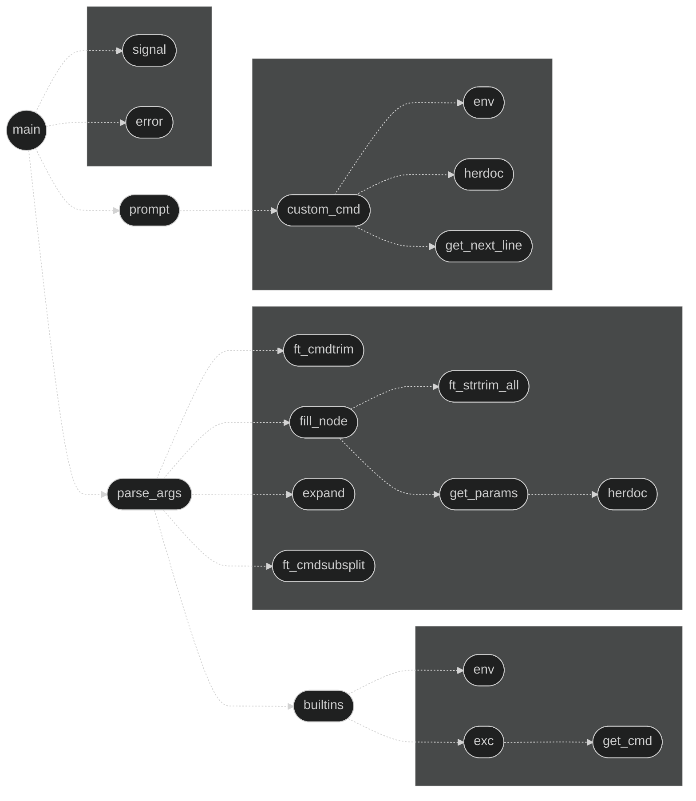
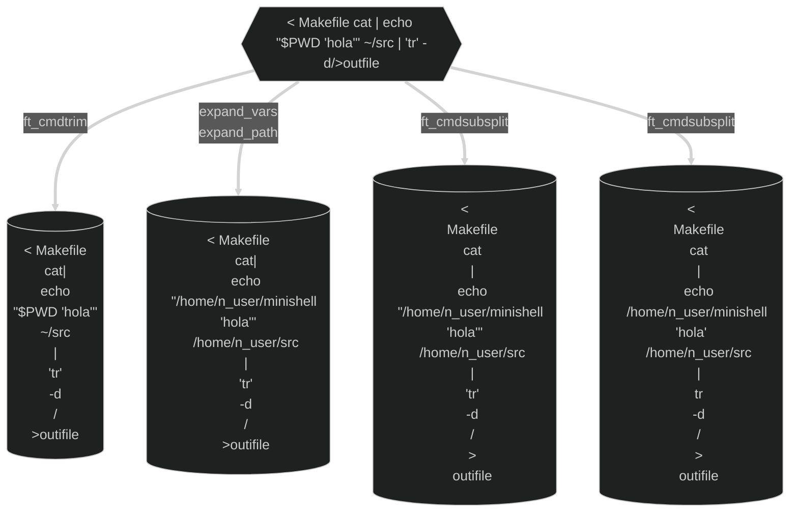

## Mind Map

```mermaid
%%{ init: { 'theme': 'dark' } }%%
graph LR
	A((main))-.->B
	A-.->D
	A-.->C
	A-.->I
	I-.->Q
	D([prompt])-.->E
	I([parse_args])
	Q([builtins])
	Q-.->R
	Q-.->S
	S-.->T
	subgraph  
		R([env])
		S([exc])
		T([get_cmd])
	end
	subgraph  
		B([signal])
		C([error])
	end
	I-.->J
	I-.->K
	I-.->L
	I-.->M
	K-.->N
	K-.->O
	O-.->P
	subgraph  
		J([ft_cmdtrim])
		K([fill_node])
		L([expand])
		M([ft_cmdsubsplit])
		N([ft_strtrim_all])
		O([get_params])
		P([herdoc])
	end
	E-.->F
	E-.->G
	E-.->H
	subgraph  
		E([custom_cmd])
		F([env])
		G([herdoc])
		H([get_next_line])
	end
```

## Parser

```mermaid
%%{ init: { 'theme': 'dark' } }%%
graph TB
    A{{"< Makefile cat | echo #quot;$PWD 'hola'#quot; ~/src | 'tr' -d/>outfile"}}
    B[("< Makefile
    cat|
    echo
    #quot;$PWD 'hola'#quot;
    ~/src
    |
    'tr'
    -d
    /
    >outifile")]
    C[("< Makefile
    cat|
    echo
    #quot;/home/n_user/minishell 'hola'#quot;
    /home/n_user/src
    |
    'tr'
    -d
    /
    >outifile")]
    D[("<
    Makefile
    cat
    |
    echo
    #quot;/home/n_user/minishell 'hola'#quot;
    /home/n_user/src
    |
    'tr'
    -d
    /
    >
    outifile")]
    E[("<
    Makefile
    cat
    |
    echo
    /home/n_user/minishell 'hola'
    /home/n_user/src
    |
    tr
    -d
    /
    >
    outifile")]
    A ==ft_cmdtrim==> B
    A ==expand_vars
    expand_path==> C
    A ==ft_cmdsubsplit==> D
    A ==ft_cmdsubsplit==> E
```