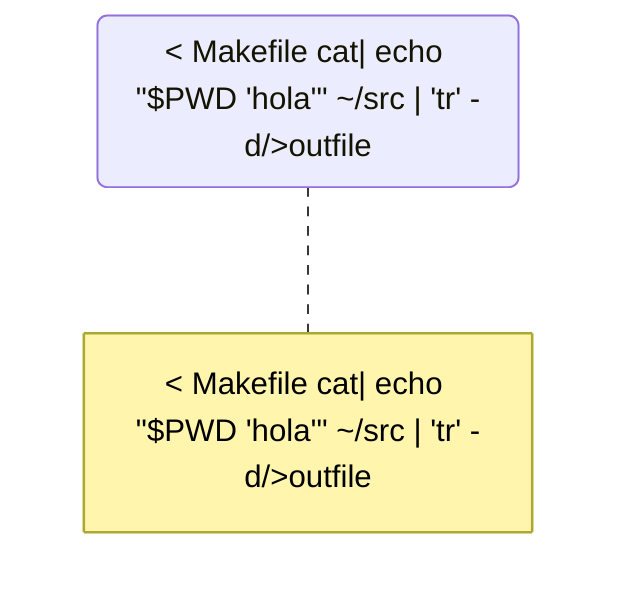

```mermaid
stateDiagram-v2
        State1: < Makefile cat| echo "$PWD 'hola'" ~/src | 'tr' -d/>outfile
		note right of State1
            < Makefile cat| echo "$PWD 'hola'" ~/src | 'tr' -d/>outfile 
        end note
```