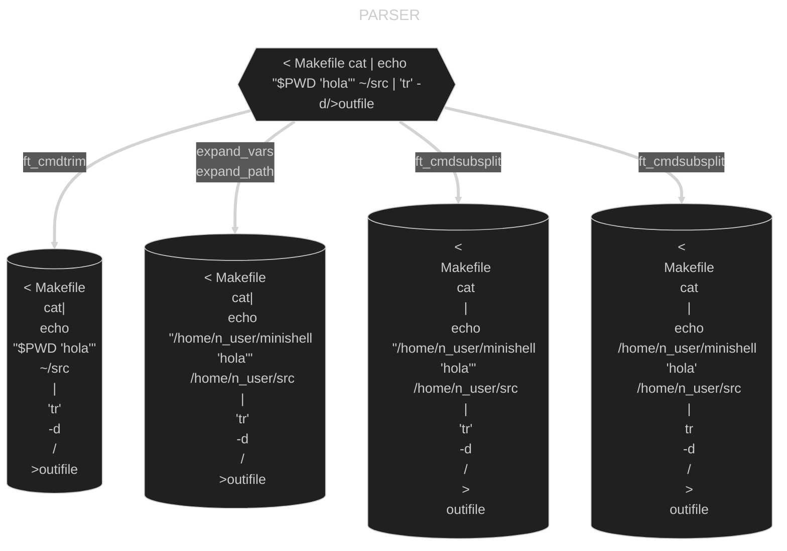

```mermaid
---
title: "PARSER"
---
%%{ init: { 'theme': 'dark' } }%%
graph TB
    A{{"< Makefile cat | echo #quot;$PWD 'hola'#quot; ~/src | 'tr' -d/>outfile"}}
    B[("< Makefile
    cat|
    echo
    #quot;$PWD 'hola'#quot;
    ~/src
    |
    'tr'
    -d
    /
    >outifile")]
    C[("< Makefile
    cat|
    echo
    #quot;/home/n_user/minishell 'hola'#quot;
    /home/n_user/src
    |
    'tr'
    -d
    /
    >outifile")]
    D[("<
    Makefile
    cat
    |
    echo
    #quot;/home/n_user/minishell 'hola'#quot;
    /home/n_user/src
    |
    'tr'
    -d
    /
    >
    outifile")]
    E[("<
    Makefile
    cat
    |
    echo
    /home/n_user/minishell 'hola'
    /home/n_user/src
    |
    tr
    -d
    /
    >
    outifile")]
    A ==ft_cmdtrim==> B
    A ==expand_vars
    expand_path==> C
    A ==ft_cmdsubsplit==> D
    A ==ft_cmdsubsplit==> E
```